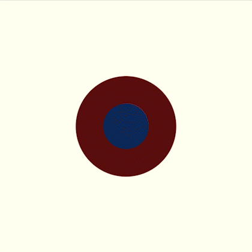

# Sefirot

This app models and visualizes the seven lower [*sefirot*](https://www.britannica.com/topic/sefirot) of Jewish metaphysics. NOTE: These models are solely intended purposes of demonstration and education. They are not to be taken as true simulations in any sense.

The sefirot are very esoteric. Esoteric need not mean "unsystematic", however. The sefirot, and the broader Kabbalistic system they are components of, have received as rigorous a treatment as any formal discipline. Notably, Leibniz, the famous mathematician and philosopher, was influenced by Kabbalah, and his mathematical and metaphysical [monads](https://en.wikipedia.org/wiki/Gottfried_Wilhelm_Leibniz#Monads) can be traced back to the Kabbalistic system of [Rabbi Isaac Luria](https://www.britannica.com/biography/Isaac-ben-Solomon-Luria). The sefirot can be understood as somewhat akin to Leibniz's metaphysical monads.

Metaphysical forces, unlike mathematical theorems, cannot be proven. Much like the existence of the number *2* or the *+* operation, the sefirot are [axioms](https://en.wikipedia.org/wiki/Axiom). They are patterns that cannot be defined (what defines *"two-ness"*, exactly?), patterns that exist above experience but can be nonetheless be experientially queried. The more pairs of objects you come across in the world, the better your internal understanding of *two-ness* becomes, the more readily you can identify other instances of *two* in external reality. The sefirot, like their  natural number cousins, (translated literaly, sefirot means "sequence") can be experientially queried. The more connections one makes between a *sefira* and its various instantiations, the better one's understanding of it becomes.

Modern science has provided beautiful examples of such symmetry, so I have chosen to highlight a particularly relevant example alongside each sefira. The sefirot (like monads), are [fractal](https://en.wikipedia.org/wiki/Fractal) structures, however, so correspondence should exist at every level of analysis -- mathematical, physical, chemical, biological, psychological, social and spiritual. Plumbing the phenomenological world for these links is a very fun task! If you  think of a connection, please don't hesitate to reach out.

These models (and my rudementary understanding of the sefirot that they are based on) are drawn from ideas in the [Midot HaYom series](https://www.thelivingtree.org/media-file/?file=audio%2Fmiddot%2Fintro+to+the+midat+hayom2.pdf) of Rabbi Matis Weinberg.

## Visualizations

### 1. Chesed: *(e.g. [Cosmic Inflation](https://en.wikipedia.org/wiki/Inflation_(cosmology)))*
`Giving infinity those that which gives infinity`

### 2. Gevurah: *(e.g. [Dimension](https://en.wikipedia.org/wiki/Dimension))*
`Holding back infinity to preserve its braches (establishing dimensions/boundaries)`

### 3. Tiferet: *(e.g. [Quantum Entanglement](https://scienceexchange.caltech.edu/topics/quantum-science-explained/entanglement))*
`Arranging what is given to ultimately unlock an aspect of infinity within its branches`

### 4. Netzach: *(e.g. [Wave Functions](https://en.wikipedia.org/wiki/Wave_function))*
`Asserting values though the modulation of what is given to its branches`

### 5. Hod: *(e.g. [Gene Expression](https://www.nature.com/scitable/topicpage/gene-expression-14121669/))*
`"Giving life" to the entire structure by yielding to some branches over others`

### 6. Yesod: *(e.g. [Flowers](https://en.wikipedia.org/wiki/Flower))*
`Channeling the root infinity down into the branches`

### 7. Malchut: *(e.g. [Ant Colony Intelligence](https://towardsdatascience.com/swarm-intelligence-inside-the-ant-colony-9ffbce22a736) and [Black Holes](https://en.wikipedia.org/wiki/Black_hole))*
`The sustaining of connected infinities that emerge from and point back to the same source`

# Developer Stuff

This project was bootstrapped with [Create React App](https://github.com/facebook/create-react-app).

To run it, just follow the directions below. **NOTE**: *I haven't yet added buttons to move between the sefirot, so the only way to see all seven is to edit the `currentSefira` variable in the `App.tsx` file. `1` corresponds to `Chesed`, `2` corresponds to `Gevurah` and so on...*

## Available Scripts

In the project directory, you can run:

### `npm start`

Runs the app in the development mode.\
Open [http://localhost:3000](http://localhost:3000) to view it in the browser.

The page will reload if you make edits.\
You will also see any lint errors in the console.

### `npm test`

Launches the test runner in the interactive watch mode.\
See the section about [running tests](https://facebook.github.io/create-react-app/docs/running-tests) for more information.

### `npm run build`

Builds the app for production to the `build` folder.\
It correctly bundles React in production mode and optimizes the build for the best performance.

The build is minified and the filenames include the hashes.\
Your app is ready to be deployed!

See the section about [deployment](https://facebook.github.io/create-react-app/docs/deployment) for more information.

### `npm run eject`

**Note: this is a one-way operation. Once you `eject`, you can’t go back!**

If you aren’t satisfied with the build tool and configuration choices, you can `eject` at any time. This command will remove the single build dependency from your project.

Instead, it will copy all the configuration files and the transitive dependencies (webpack, Babel, ESLint, etc) right into your project so you have full control over them. All of the commands except `eject` will still work, but they will point to the copied scripts so you can tweak them. At this point you’re on your own.

You don’t have to ever use `eject`. The curated feature set is suitable for small and middle deployments, and you shouldn’t feel obligated to use this feature. However we understand that this tool wouldn’t be useful if you couldn’t customize it when you are ready for it.

## Learn More

You can learn more in the [Create React App documentation](https://facebook.github.io/create-react-app/docs/getting-started).

To learn React, check out the [React documentation](https://reactjs.org/).
